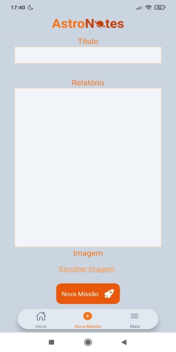

# AstroNotes :man_astronaut: :woman_astronaut: :rocket:

O AstroNotes é um bloco de notas ou um diário pessoal, depende do usuário. O tema principal do aplicativo, como o nome sugere, é astronautas, espaço e etc.

## O projeto utiliza:

- [React Native](https://reactnative.dev/)
- [TypeScript](https://www.typescriptlang.org/)
- [React Navigation](https://reactnavigation.org/)
- [Tailwind](https://tailwindcss.com/)
- [Formik](https://formik.org/)
- [LottieFiles](https://lottiefiles.com/)
- [Firebase](https://firebase.google.com/?hl=pt)
- [Zustand](https://zustand-demo.pmnd.rs/)

## Utilização:

#### Há dois métodos de utilização. O Primeiro é o mais fácil e também o sugerido, apenas baixe e instale o app. O segundo deriva um pouco mais de tempo e conhecimento das plataformas utilizadas.

### 1. Baixe O APK:

Instale o APK usando o QR Code ou o Link:

[CLIQUE AQUI PARA FAZER O DOWNLOAD](https://expo.dev/artifacts/eas/9czMuU86kXSoq84xFadWGc.apk)

Após a instalação abra um gerenciador de arquivos e instale o app.

ps: apenas para Android.

### 2. Faça Download Do Repositório:

Após clonar ou baixar o resposiório. :arrow_down:

Instale as dependências utilizando o terminal com o comando:

`npm i`

Após a instalação execute o comando abaixo. Irá prover um QR Code e um link:

`npx expo start`

Por fim, instale o app Expo Go no seu smartphone abra-o e use o QR Code ou o link:

[Expo Go](https://expo.dev/client)

ps: será necessário a criação de um projeto no Firebase.

## Imagens :arrow_down:

